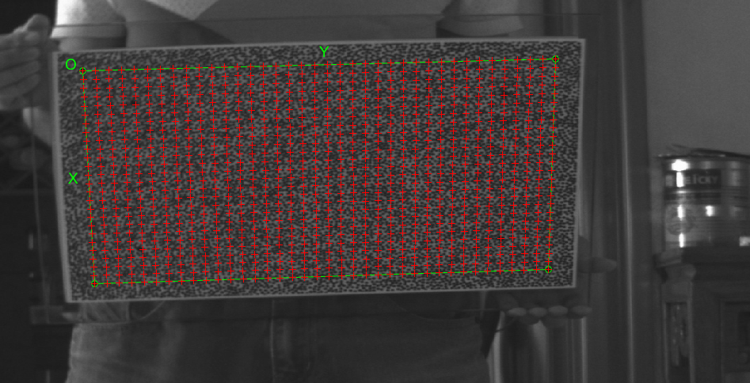

# High accuracy Calib_toolbox
origin from [Jean-Yves Bouguet](http://www.vision.caltech.edu/bouguetj/calib_doc/)
changed by [eros.wade](https://eroswade.github.io/) 
licese by MIT

If you have any question/suggestion/bug report please send me email at
sjlou1126@163.com

Eros.Wade
2017.08.09

## accurate
it's about 2% Z direction and 0.2% x,y direction accuracy.

## how it's work?
using ProjFromPyNxt to project physic back to image. and using xcorr to find the diffence between to image (reprojected image and origin image like ImLeft )
iter cal for several times. 

## how to use it
#### step one 
same as Jean-Yves Bouguet's toolbox
##### calib_gui_normal
* into images folder
* run command calib_gui_normal
* click "Image Names"

.              ImLeft12.jpg   ImLeft18.jpg   ImLeft23.jpg   ImLeft5.jpg    ImRight10.jpg  ImRight16.jpg  ImRight21.jpg  ImRight3.jpg   
..             ImLeft13.jpg   ImLeft19.jpg   ImLeft24.jpg   ImLeft6.jpg    ImRight11.jpg  ImRight17.jpg  ImRight22.jpg  ImRight4.jpg   
ImLeft0.jpg    ImLeft14.jpg   ImLeft2.jpg    ImLeft25.jpg   ImLeft7.jpg    ImRight12.jpg  ImRight18.jpg  ImRight23.jpg  ImRight5.jpg   
ImLeft1.jpg    ImLeft15.jpg   ImLeft20.jpg   ImLeft26.jpg   ImLeft8.jpg    ImRight13.jpg  ImRight19.jpg  ImRight24.jpg  ImRight6.jpg   
ImLeft10.jpg   ImLeft16.jpg   ImLeft21.jpg   ImLeft3.jpg    ImRight0.jpg   ImRight14.jpg  ImRight2.jpg   ImRight25.jpg  ImRight7.jpg   
ImLeft11.jpg   ImLeft17.jpg   ImLeft22.jpg   ImLeft4.jpg    ImRight1.jpg   ImRight15.jpg  ImRight20.jpg  ImRight26.jpg  ImRight8.jpg   

Basename camera calibration images (without number nor suffix): ImLeft
Image format: ([]='r'='ras', 'b'='bmp', 't'='tif', 'p'='pgm', 'j'='jpg', 'm'='ppm') j
Loading image 1...2...3...4...5...6...7...8...9...11...12...13...14...15...16...17...18...19...20...21...22...23...24...25...26...27...

* "extract grid corners"
    wintx =2 winty=2 
    Number of squares along the X direction ([]=10) = 25
    Number of squares along the Y direction ([]=10) = 37
    Size dX of each square along the X direction ([]=100mm) = 10
    Size dY of each square along the Y direction ([]=100mm) = 10
    
* click "Calibration"
* rename Calib_Results.mat to Calib_Results_origin.mat  then copy to fold "Left"
* cal right image ,and save to fold "Right"

#### step two 
* cd Left
* run IterCal.m
* after few hours (maybe 4 hours)
* copy Calib_Results_left to folder stereo 
* cd Right 
* run IterCal.m
* copy Calib_Results_right to folder stereo

